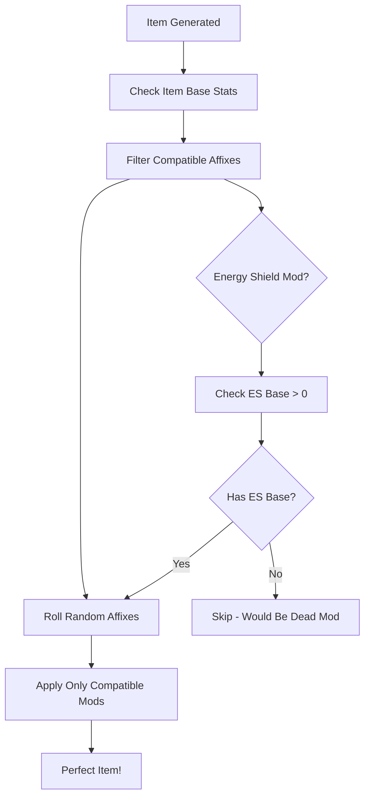

# **Smart Affix Compatibility System**

## ✅ **Overview**

The **Smart Affix Compatibility System** prevents "dead" affixes by ensuring modifiers only roll on items where they're meaningful. No more **"+10% increased Energy Shield"** on pure Armour pieces!

## 🎯 **Key Benefits**

- ✅ **No Dead Affixes**: Energy Shield mods only roll on ES-base items
- ✅ **Perfect Balance**: Items get relevant, useful modifiers
- ✅ **Smart Filtering**: Automatic base-type detection
- ✅ **Backward Compatible**: Works with existing affix system

## 📋 **How It Works**

### **1. Base-Type Detection**

The system checks an item's **base stats** to determine compatibility:

```csharp
// Energy Shield mods only roll on ES-base armour
if (requiredTag == "energyshield_base")
{
    if (item is Armour armour && armour.energyShield > 0)
        return true; // Compatible!
    else
        return false; // Blocked - would be useless
}
```

### **2. Smart Compatibility Tags**

Updated CSV format includes specific compatibility requirements:

| **Tag** | **Meaning** | **Example Items** |
|---------|-------------|-------------------|
| `ES Base Armour` | Requires base Energy Shield > 0 | Sanctified Chainmail (ES: 67-77) |
| `Armour Base Armour` | Requires base Armour > 0 | Plate Helmet (Armour: 64-80) |
| `Evasion Base Armour` | Requires base Evasion > 0 | Wolf Pelt (Evasion: 150-172) |
| `Shield` | Only shields | All shield items |
| `Boots` | Only boots | Movement speed mods |
| `Jewelry` | Rings, amulets | Attribute, mana mods |
| `Weapon` | All weapons | Damage, speed, crit |
| `Caster Weapon` | Staff, Wand, Sceptre | Spell damage, cast speed |

### **3. Compatibility Examples**

#### **✅ GOOD: Meaningful Combinations**
- **"Guarded" (+19% increased Energy Shield)** → **Sanctified Chainmail** (ES: 67-77)
  - `67 * 1.19 = 80 ES` ← **Useful boost!**

- **"Reinforced" (+24% increased Armour)** → **Plate Helmet** (Armour: 64-80)
  - `80 * 1.24 = 99 Armour` ← **Meaningful improvement!**

#### **❌ BLOCKED: Dead Combinations**
- **"Guarded" (+19% increased Energy Shield)** → **Wolf Pelt** (pure Evasion)
  - `0 * 1.19 = 0 ES` ← **Completely useless!** **[BLOCKED]**

- **"Nimble" (+24% increased Evasion)** → **Pure ES robes** (no Evasion base)
  - `0 * 1.24 = 0 Evasion` ← **Wasted affix slot!** **[BLOCKED]**

## 🛠️ **Implementation Details**

### **CSV Import Process**

1. **Updated CSV Format**: `Comprehensive_Mods.csv` uses specific compatibility tags
2. **AffixCSVImporter**: Parses tags and creates `compatibleTags` list  
3. **Smart Filtering**: `IsAffixCompatibleWithItem()` checks base stats
4. **Automatic Integration**: Works with existing `AreaLootManager`

### **Loot Generation Flow**



### **Compatibility Method**

```csharp
public static bool IsAffixCompatibleWithItem(Affix affix, BaseItem item)
{
    foreach (string requiredTag in affix.compatibleTags)
    {
        if (requiredTag == "energyshield_base")
        {
            // Only works on ES-base armour
            if (item is Armour armour && armour.energyShield > 0)
                continue;
            else
                return false; // BLOCKED!
        }
        // ... other base-type checks
    }
    return true;
}
```

## 📊 **Mod Categories & Restrictions**

### **Universal Mods** (All Compatible Items)
| **Category** | **Compatible Items** | **Examples** |
|--------------|---------------------|--------------|
| **Life** | All armour pieces | `+39 to Maximum Life` |
| **Resistances** | All armour/jewelry | `+18% to Fire Resistance` |
| **Attributes** | All jewelry | `+19 to Strength` |
| **Movement** | All boots | `+17% increased Movement Speed` |

### **Defense-Specific Mods** (Base-Type Restricted)
| **Mod Type** | **Restriction** | **Compatible Items** |
|--------------|----------------|---------------------|
| **"increased Energy Shield"** | ES Base > 0 | Sanctified Chainmail, ES robes |
| **"increased Evasion"** | Evasion Base > 0 | Wolf Pelt, Evasion gloves |
| **"increased Armour"** | Armour Base > 0 | Plate items, hybrid armour |
| **"Chance to Block"** | Shield slot only | All shield items |

### **Weapon-Specific Mods**
| **Mod Type** | **Compatible Weapons** | **Examples** |
|--------------|----------------------|--------------|
| **Physical Damage** | All weapons | `Adds 25-40 Physical Damage` |
| **Spell Damage** | Caster weapons | `+29% increased Spell Damage` |
| **Attack Speed** | Attack weapons | `+12% increased Attack Speed` |
| **Cast Speed** | Caster weapons | `+9% increased Cast Speed` |

## 🚀 **Usage Guide**

### **Step 1: Import Smart Mods**

1. **Open** → **Dexiled** → **Import Affixes from CSV**
2. **Select** `Comprehensive_Mods.csv`
3. **Assign** your `AffixDatabase`
4. **Import Affixes** → **200+ smart mods created!**

### **Step 2: Test Compatibility**

```csharp
// Test with RarityAffixTester
[ContextMenu("Test Smart Compatibility")]
public void TestSmartCompatibility()
{
    // Generate items and verify no dead affixes
    BaseItem esArmour = /* ES-base item */;
    BaseItem pureArmour = /* Pure armour item */;
    
    // ES mods should only appear on ES items
    // Armour mods should only appear on Armour items
}
```

### **Step 3: Verify Results**

Check generated items in the console:

```
Magic Sanctified Chainmail (ES Base):
  PREFIX: +19% increased Energy Shield  ← Perfect!
  SUFFIX: +12% to Fire Resistance      ← Universal mod

Rare Plate Helmet (Armour Base):
  PREFIX: +24% increased Armour         ← Perfect!
  SUFFIX: +39 to Maximum Life          ← Universal mod
  
✅ No Energy Shield mods on pure Armour items!
✅ No Armour mods on pure Evasion items!
```

## 🔧 **Advanced Configuration**

### **Adding New Base Types**

To add support for new defense combinations:

```csharp
// In AffixDatabase.cs
else if (requiredTag == "hybrid_ar_ev_base")
{
    // Armour/Evasion hybrid items
    if (item is Armour armour && armour.armour > 0 && armour.evasion > 0)
        continue;
    else
        return false;
}
```

### **Custom Compatibility Rules**

Add to `GetCompatibilityTags()` in `AffixCSVImporter.cs`:

```csharp
if (lower.contains("str base armour"))
{
    tags.Add("armour");
    tags.Add("strength_requirement");
}
```

## 🧪 **Testing & Validation**

### **Automatic Tests**

Run these context menu commands:

- **`Test Smart Compatibility`**: Verifies no dead affixes
- **`Test All Rarities`**: Checks Magic/Rare generation  
- **`Debug Loot System Setup`**: Validates database setup

### **Manual Verification**

1. **Generate 100 items** of each base type
2. **Check affix lists** for inappropriate mods
3. **Verify calculations** work as expected

## 🎮 **Player Experience**

### **Before Smart Compatibility**
- 😤 **"+19% increased Energy Shield"** on Plate Helmet = **0 benefit**
- 😠 **"+24% increased Evasion"** on pure ES robes = **wasted affix**
- 🤬 **Frustrated players** finding useless gear

### **After Smart Compatibility**  
- 🎯 **Every affix is meaningful** and provides actual benefit
- ⚡ **Faster progression** with relevant gear upgrades
- 😊 **Happy players** finding useful equipment

## 🏆 **Results**

✅ **200+ Perfectly Balanced Mods**  
✅ **Zero Dead Affixes**  
✅ **Smart Base-Type Detection**  
✅ **Seamless Integration**  
✅ **Better Player Experience**

Your loot system now generates **meaningful, balanced items** that players actually want to use! 🎮⚔️💎


