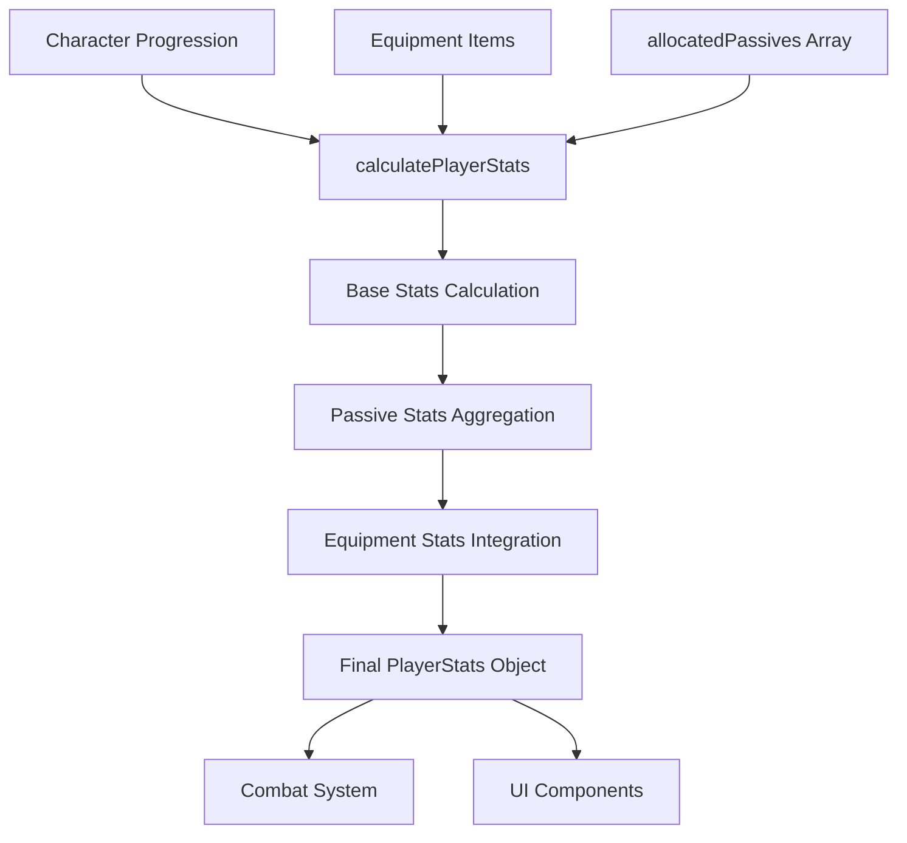

# Modular Passive Tree System - Technical Architecture

## Table of Contents

1. [System Architecture Overview](#1-system-architecture-overview)
2. [Data Structure & Type System](#2-data-structure--type-system)
3. [Data Flow Architecture](#3-data-flow-architecture)
4. [State Management Integration](#4-state-management-integration)
5. [Board Connection System](#5-board-connection-system)
6. [File Organization & Modularity](#6-file-organization--modularity)
7. [Performance Considerations](#7-performance-considerations)
8. [Integration Points with Other Systems](#8-integration-points-with-other-systems)
9. [Data Persistence](#9-data-persistence)
10. [Key Technical Benefits](#10-key-technical-benefits)

---

## 1. System Architecture Overview

The modular passive tree system is built as a **layered architecture** with clear separation of concerns:

```
┌─────────────────────────────────────────────────────────────┐
│                    UI Layer (React)                        │
│  ┌─────────────────┐  ┌─────────────────┐  ┌─────────────┐ │
│  │ ModularPassive  │  │ BoardSelection  │  │ Board       │ │
│  │ Tree Component  │  │ Modal           │  │ Component   │ │
│  └─────────────────┘  └─────────────────┘  └─────────────┘ │
└─────────────────────────────────────────────────────────────┘
┌─────────────────────────────────────────────────────────────┐
│                  State Management Layer                     │
│  ┌─────────────────┐  ┌─────────────────┐  ┌─────────────┐ │
│  │ GameStateContext│  │ PlayerPassive   │  │ Board       │ │
│  │                 │  │ State           │  │ Connections │ │
│  └─────────────────┘  └─────────────────┘  └─────────────┘ │
└─────────────────────────────────────────────────────────────┘
┌─────────────────────────────────────────────────────────────┐
│                    Data Layer                               │
│  ┌─────────────────┐  ┌─────────────────┐  ┌─────────────┐ │
│  │ ModularPassive  │  │ ExtensionBoards │  │ Passive     │ │
│  │ Tree Data       │  │ (Individual     │  │ Node Types  │ │
│  │                 │  │ Board Files)    │  │             │ │
│  └─────────────────┘  └─────────────────┘  └─────────────┘ │
└─────────────────────────────────────────────────────────────┘
┌─────────────────────────────────────────────────────────────┐
│                  Stat Calculation Layer                     │
│  ┌─────────────────┐  ┌─────────────────┐  ┌─────────────┐ │
│  │ calculatePlayer │  │ Passive Stats   │  │ Equipment   │ │
│  │ Stats Function  │  │ Aggregation     │  │ Integration │ │
│  └─────────────────┘  └─────────────────┘  └─────────────┘ │
└─────────────────────────────────────────────────────────────┘
```

### Architecture Principles

- **Separation of Concerns**: Each layer has a specific responsibility
- **Data Flow**: Unidirectional data flow from data layer to UI
- **Modularity**: Independent components that can be developed separately
- **Type Safety**: Comprehensive TypeScript interfaces throughout
- **Performance**: Optimized for real-time stat calculations

---

## 2. Data Structure & Type System

### Core Data Types

```typescript
// Main tree structure
interface ModularPassiveTree {
  coreBoard: PassiveBoard;
  extensionBoards: Record<string, PassiveBoard>;
  keystoneBoards: Record<string, KeystoneBoard>;
  boardLimits: BoardLimits;
}

// Individual board structure
interface PassiveBoard {
  id: string;
  name: string;
  description: string;
  theme: string;
  size: { rows: number; columns: number };
  nodes: PassiveNode[][];  // 2D grid of nodes
  extensionPoints: ExtensionPoint[];
  maxPoints: number;
}

// Individual node structure
interface PassiveNode {
  id: string;
  name: string;
  description: string;
  position: { row: number; column: number };
  type: 'main' | 'extension' | 'notable' | 'travel' | 'small' | 'keystone';
  stats: Record<string, number>;  // Key stat integration point
  maxRank: number;
  currentRank: number;
  cost: number;
  requirements: string[];
  connections: string[];
}

// Player state tracking
interface PlayerPassiveState {
  allocatedNodes: string[];        // Array of allocated node IDs
  connectedBoards: string[];       // Array of connected board IDs
  boardConnections: BoardConnection[]; // Connection metadata
  availablePoints: number;
}
```

### Node Types and Costs

| Type | Symbol | Description | Cost | Purpose |
|------|--------|-------------|------|---------|
| Main | M | Starting point | 0 | Universal starting node |
| Extension | EXT | Board connection point | 0 | Connect boards together |
| Notable | N | Powerful passive | 2 | Significant bonuses |
| Travel | T | Attribute nodes | 1 | Basic attributes |
| Small | S | Minor bonuses | 1 | Small stat increases |
| Keystone | KS | Build-defining effect | 5 | Major gameplay changes |

### Board Themes

```typescript
type BoardTheme = 
  | 'fire' | 'cold' | 'lightning' | 'chaos' | 'physical' | 'life' 
  | 'armor' | 'evasion' | 'critical' | 'speed' | 'utility' | 'elemental' | 'keystone';
```

---

## 3. Data Flow Architecture

### Stat Calculation Pipeline



### Passive Stat Integration Process

```typescript
// Key integration point in calculatePlayerStats function
export function calculatePlayerStats(
  characterProgression: CharacterProgression,
  equipped: Record<string, GearItem | null>,
  allocatedPassives: string[] = [],  // ← Passive tree integration
  enduranceCharges: number = 0,
  statusEffects: any[] = []
): PlayerStats {
  
  // 1. Initialize base stats
  const stats: PlayerStats = { /* base stats */ };
  
  // 2. Aggregate passive node stats
  const passiveStats: Record<string, number> = {};
  
  // Get all nodes from modular passive tree
  const getAllModularNodes = () => {
    const nodes: any[] = [];
    nodes.push(...MODULAR_PASSIVE_TREE.coreBoard.nodes.flat());
    Object.values(MODULAR_PASSIVE_TREE.extensionBoards).forEach((board: any) => {
      nodes.push(...board.nodes.flat());
    });
    Object.values(MODULAR_PASSIVE_TREE.keystoneBoards).forEach((board: any) => {
      nodes.push(...board.nodes.flat());
    });
    return nodes;
  };
  
  const allNodes = getAllModularNodes();
  
  // Sum stats from allocated passive nodes
  for (const nodeId of allocatedPassives) {
    const node = allNodes.find(n => n.id === nodeId);
    if (node && node.stats) {
      for (const [k, v] of Object.entries(node.stats)) {
        passiveStats[k] = (passiveStats[k] || 0) + (v as number);
      }
    }
  }
  
  // 3. Apply passive stats to final stats object
  for (const [k, v] of Object.entries(passiveStats)) {
    (stats as any)[k] = ((stats as any)[k] || 0) + v;
  }
  
  // 4. Continue with equipment and other stat sources...
}
```

### Data Flow Steps

1. **Input Collection**: Gather character progression, equipment, and allocated passives
2. **Base Calculation**: Calculate base stats from character level and class
3. **Passive Aggregation**: Sum all stats from allocated passive nodes
4. **Equipment Integration**: Add equipment bonuses to stats
5. **Final Assembly**: Combine all stat sources into final PlayerStats object
6. **System Distribution**: Distribute final stats to combat, UI, and other systems

---

## 4. State Management Integration

### GameStateContext Integration

```typescript
// GameState interface includes passive tree state
export interface GameState {
  // ... other state properties
  allocatedPassives: string[];        // ← Passive allocations
  boardConnections: BoardConnection[]; // ← Board connection metadata
  playerStats: PlayerStats;           // ← Calculated stats (includes passives)
}

// State updates when passives are allocated
const handleAllocatePending = () => {
  if (pendingNodes.length === 0) return;
  
  setGameState(prev => {
    const newAllocated = [...(prev.allocatedPassives || []), ...pendingNodes];
    return {
      ...prev,
      allocatedPassives: newAllocated,
      characterProgression: {
        ...prev.characterProgression,
        skillPoints: (prev.characterProgression.skillPoints || 0) - pendingNodes.length
      },
      // ← Key integration: Recalculate player stats with new passives
      playerStats: calculatePlayerStats(
        prev.characterProgression,
        prev.equipped,
        newAllocated  // ← Updated passive allocations
      )
    };
  });
};
```

### Real-time Stat Updates

The system provides **real-time stat updates** through multiple integration points:

```typescript
// 1. Character Sheet Component
const playerStats = calculatePlayerStats(
  characterProgression, 
  equipped, 
  allocatedPassives,  // ← Passive tree integration
  0, 
  []
);

// 2. Combat Screen
let playerStats = calculatePlayerStats(
  gameState.characterProgression, 
  gameState.equipped, 
  gameState.allocatedPassives,  // ← Passive tree integration
  0
);

// 3. Equipment changes trigger passive recalculation
const handleEquipItem = (item: GearItem, slot: EquipmentSlot) => {
  setGameState(prev => ({
    ...prev,
    equipped: newEquipped,
    // ← Recalculate with current passives
    playerStats: calculatePlayerStats(
      prev.characterProgression, 
      newEquipped, 
      prev.allocatedPassives  // ← Maintain passive integration
    )
  }));
};
```

### State Update Triggers

| Trigger | Action | Result |
|---------|--------|--------|
| Passive Allocation | Add node ID to `allocatedPassives` | Recalculate `playerStats` |
| Passive Deallocation | Remove node ID from `allocatedPassives` | Recalculate `playerStats` |
| Board Connection | Add connection to `boardConnections` | Update available boards |
| Equipment Change | Update `equipped` items | Recalculate `playerStats` |
| Level Up | Increase `skillPoints` | Allow more passive allocations |

---

## 5. Board Connection System

### Auto-Allocation Logic

```typescript
// Intelligent extension point auto-allocation
const isOpposite = (
  // Core ↔ Fire mappings
  (sourceExt === 'core_ext_right' && targetExt === 'fire_ext_left') ||
  (sourceExt === 'core_ext_left' && targetExt === 'fire_ext_right') ||
  (sourceExt === 'core_ext_top' && targetExt === 'fire_ext_bottom') ||
  (sourceExt === 'fire_ext_left' && targetExt === 'core_ext_right') ||
  (sourceExt === 'fire_ext_right' && targetExt === 'core_ext_left') ||
  (sourceExt === 'fire_ext_bottom' && targetExt === 'core_ext_top')
);

// When connecting boards, auto-allocate opposite extension points
if (isOpposite && isNodeAllocated(boardConnection.extensionPointId)) {
  return true; // Auto-allocate opposite extension point
}
```

### Board Connection State

```typescript
interface BoardConnection {
  extensionPointId: string;    // Source extension point
  boardId: string;             // Connected board ID
  boardRotation: number;       // Rotation (0, 90, 180, 270)
  boardFlip: 'none' | 'horizontal' | 'vertical' | 'both';
  boardPosition?: { x: number; y: number };
}
```

### Connection Process

1. **Extension Point Click**: Player clicks on extension point
2. **Board Selection**: Modal shows available boards for connection
3. **Validation**: Check board limits and theme restrictions
4. **Connection Creation**: Create BoardConnection object
5. **Auto-Allocation**: Automatically allocate opposite extension points
6. **State Update**: Update game state with new connection
7. **UI Refresh**: Re-render connected boards

### Board Limits System

```typescript
export const BOARD_LIMITS: BoardLimits = {
  maxExtensionBoards: 8,
  maxKeystoneBoards: 16,
  maxBoardsPerTheme: {
    fire: 3,
    chaos: 3,
    cold: 3,
    lightning: 3,
    physical: 3,
    life: 3,
    armor: 3,
    evasion: 3,
    critical: 3,
    speed: 3,
    utility: 3,
    elemental: 3,
    keystone: 16
  }
};
```

---

## 6. File Organization & Modularity

### Extension Boards Structure

```
src/data/ExtensionBoards/
├── index.ts                    # Central export file
├── CoreBoard.ts               # Universal starting board
├── FireBoard.ts               # Fire-themed extension board
├── FireKeystoneBoard.ts       # Fire keystone board (1x3 layout)
├── ColdBoard.ts               # Cold-themed extension board
├── LightningBoard.ts          # Lightning-themed extension board
├── ChaosBoard.ts              # Chaos-themed extension board
├── LifeDefenseBoard.ts        # Life/defense themed board
├── CriticalBoard.ts           # Critical strike themed board
├── MaxResFireBoard.ts         # Maximum resistance boards
├── MaxResColdBoard.ts         # Maximum resistance boards
├── MaxResLightningBoard.ts    # Maximum resistance boards
├── SpellPowerBoard.ts         # Spell power themed board
├── DiscardUtilityBoard.ts     # Discard mechanics board
├── BleedPoisonAilmentBoard.ts # Ailment themed board
├── RelianceBoard.ts           # Reliance system board
├── ElementalDamageBoard.ts    # Elemental damage board
├── ESDefenseBoard.ts          # Energy Shield defense board
├── IgniteAilmentBoard.ts      # Ignite ailment board
├── WeaponSwordBoard.ts        # Weapon-specific board
├── StaffBoards.ts             # Staff weapon boards
├── LightningBoard.ts          # Lightning themed boards
├── DiscardBoards.ts           # Discard mechanic boards
├── ColdElementalFireLightningBoards.ts # Elemental boards
├── BloodEagleKeystoneBoard.ts # Keystone boards
├── DesperatePowerKeystoneBoard.ts
├── PrismaticThresholdKeystoneBoard.ts
├── OathOfContactKeystoneBoard.ts
├── SteelResolveKeystoneBoard.ts
├── PureEssenceKeystoneBoard.ts
├── ArcaneShieldKeystoneBoard.ts
├── SpectralDrainKeystoneBoard.ts
├── DivineConversionKeystoneBoard.ts
├── OathOfRecoveryKeystoneBoard.ts
├── UnbreakableWillKeystoneBoard.ts
├── MightOfTheMindKeystoneBoard.ts
├── ForceProjectionKeystoneBoard.ts
├── ElementalHarmonyKeystoneBoard.ts
└── OathOfSufferingKeystoneBoard.ts
```

### Board Creation Pattern

```typescript
// Standard board creation pattern
export const FIRE_BOARD: PassiveBoard = {
  id: 'fire_board',
  name: 'Infernal Mastery',
  description: 'Master the destructive power of fire',
  theme: 'fire',
  size: { rows: 7, columns: 7 },
  nodes: [
    // 7x7 grid of nodes with fire-themed stats
    [
      { id: 'fire_1_1', name: 'Fire Damage', description: '+10% Fire Damage', 
        position: { row: 0, column: 0 }, type: 'small', 
        stats: { fireIncrease: 10 }, maxRank: 1, currentRank: 0, cost: 1, 
        requirements: [], connections: ['fire_1_2'] },
      // ... more nodes
    ],
    // ... more rows
  ],
  extensionPoints: [
    { id: 'fire_ext_left', position: { row: 3, column: 0 }, 
      availableBoards: ['chaos_board'], maxConnections: 1, currentConnections: 0 },
    // ... more extension points
  ],
  maxPoints: 15
};
```

### Keystone Board Pattern

```typescript
// Keystone boards use 1x3 layout (extension + keystone + powerful notable)
export const FIRE_KEYSTONE_BOARD: KeystoneBoard = {
  id: 'fire_keystone',
  name: 'Infernal Ascension',
  description: 'Transcend mortal limitations through fire mastery',
  theme: 'keystone',
  size: { rows: 1, columns: 3 },
  nodes: [
    [
      { id: 'fire_ks_ext_point', name: '', description: '', 
        position: { row: 0, column: 0 }, type: 'extension', 
        stats: {}, maxRank: 1, currentRank: 0, cost: 0, 
        requirements: [], connections: [] },
      { id: 'fire_keystone_1', name: 'Infernal Ascension', 
        description: 'Transform into a being of pure fire...', 
        position: { row: 0, column: 1 }, type: 'keystone', 
        stats: { fireIncrease: 50, addedPhysicalAsFire: 100, /* ... */ }, 
        maxRank: 1, currentRank: 0, cost: 1, 
        requirements: [], connections: [] },
      { id: 'fire_ks_powerful_notable', name: 'Phoenix Rebirth', 
        description: '+50% Fire Damage, +30% Elemental Resistances...', 
        position: { row: 0, column: 2 }, type: 'notable', 
        stats: { fireIncrease: 50, elementalResist: 30, chanceToIgnite: 25 }, 
        maxRank: 1, currentRank: 0, cost: 1, 
        requirements: [], connections: [] }
    ]
  ],
  extensionPoints: [
    { id: 'fire_ks_ext_point', position: { row: 0, column: 0 }, 
      availableBoards: [], maxConnections: 1, currentConnections: 0 }
  ],
  keystoneEffect: 'infernal_ascension',
  maxPoints: 2  // Extension (0) + Keystone (1) + Notable (1) = 2 total
};
```

---

## 7. Performance Considerations

### Stat Calculation Optimization

```typescript
// Efficient node lookup using flat array
const getAllModularNodes = () => {
  const nodes: any[] = [];
  
  // Pre-flatten all nodes for O(1) lookup
  nodes.push(...MODULAR_PASSIVE_TREE.coreBoard.nodes.flat());
  Object.values(MODULAR_PASSIVE_TREE.extensionBoards).forEach((board: any) => {
    nodes.push(...board.nodes.flat());
  });
  Object.values(MODULAR_PASSIVE_TREE.keystoneBoards).forEach((board: any) => {
    nodes.push(...board.nodes.flat());
  });
  
  return nodes;
};

// O(n) stat aggregation where n = number of allocated nodes
for (const nodeId of allocatedPassives) {
  const node = allNodes.find(n => n.id === nodeId);
  if (node && node.stats) {
    for (const [k, v] of Object.entries(node.stats)) {
      passiveStats[k] = (passiveStats[k] || 0) + (v as number);
    }
  }
}
```

### State Update Batching

```typescript
// Batch multiple passive allocations in single state update
const handleAllocatePending = () => {
  if (pendingNodes.length === 0) return;
  
  setGameState(prev => {
    const newAllocated = [...(prev.allocatedPassives || []), ...pendingNodes];
    return {
      ...prev,
      allocatedPassives: newAllocated,
      characterProgression: {
        ...prev.characterProgression,
        skillPoints: (prev.characterProgression.skillPoints || 0) - pendingNodes.length
      },
      // Single stat recalculation for all pending nodes
      playerStats: calculatePlayerStats(
        prev.characterProgression,
        prev.equipped,
        newAllocated
      )
    };
  });
};
```

### Performance Optimizations

| Optimization | Technique | Benefit |
|--------------|-----------|---------|
| **Node Lookup** | Pre-flattened arrays | O(1) node access |
| **Stat Aggregation** | Single pass through allocated nodes | O(n) where n = allocated nodes |
| **State Updates** | Batched updates | Single re-render per batch |
| **Board Rendering** | Virtual rendering for large boards | Reduced DOM nodes |
| **Connection Caching** | Memoized connection calculations | Avoid redundant calculations |

### Memory Management

- **Node References**: Use node IDs instead of full node objects
- **Stat Objects**: Reuse stat objects where possible
- **Connection Caching**: Cache board connection calculations
- **Garbage Collection**: Clean up unused board references

---

## 8. Integration Points with Other Systems

### Combat System Integration

```typescript
// Combat screen uses passive-enhanced stats
const CombatScreen = () => {
  const { gameState } = useGameState();
  
  // Passive tree stats automatically included in combat calculations
  let playerStats = calculatePlayerStats(
    gameState.characterProgression, 
    gameState.equipped, 
    gameState.allocatedPassives,  // ← Passive integration
    0
  );
  
  // All combat calculations use passive-enhanced stats
  const damage = calculateDamage(playerStats, card, enemy);
};
```

### Equipment System Integration

```typescript
// Equipment changes trigger passive recalculation
const handleEquipItem = (item: GearItem, slot: EquipmentSlot) => {
  setGameState(prev => {
    const newEquipped = { ...prev.equipped, [slot]: item };
    return {
      ...prev,
      equipped: newEquipped,
      // Recalculate with current passives + new equipment
      playerStats: calculatePlayerStats(
        prev.characterProgression, 
        newEquipped, 
        prev.allocatedPassives  // ← Maintain passive integration
      )
    };
  });
};
```

### Character Progression Integration

```typescript
// Level-up grants skill points for passive tree
const handleLevelUp = () => {
  setGameState(prev => ({
    ...prev,
    characterProgression: {
      ...prev.characterProgression,
      level: prev.characterProgression.level + 1,
      skillPoints: (prev.characterProgression.skillPoints || 0) + 1  // ← Passive tree points
    }
  }));
};
```

### Integration Summary

| System | Integration Point | Data Flow |
|--------|------------------|-----------|
| **Combat** | `calculatePlayerStats()` | Passive stats → Combat calculations |
| **Equipment** | Equipment change handlers | Equipment + Passives → Recalculated stats |
| **Character Progression** | Level-up system | Skill points → Passive allocations |
| **UI Components** | Stat display components | Passive stats → UI rendering |
| **Save/Load** | Game state persistence | Passive allocations → Persistent storage |

---

## 9. Data Persistence

### Save/Load System

```typescript
// Passive allocations persist across sessions
const saveGameState = (gameState: GameState) => {
  const saveData = {
    // ... other save data
    allocatedPassives: gameState.allocatedPassives,  // ← Passive persistence
    boardConnections: gameState.boardConnections,    // ← Board connection persistence
  };
  localStorage.setItem('gameState', JSON.stringify(saveData));
};

const loadGameState = (): GameState => {
  const savedData = localStorage.getItem('gameState');
  if (savedData) {
    const parsed = JSON.parse(savedData);
    return {
      // ... other loaded data
      allocatedPassives: parsed.allocatedPassives || [],  // ← Load passive allocations
      boardConnections: parsed.boardConnections || [],    // ← Load board connections
    };
  }
  return defaultGameState;
};
```

### Persistence Strategy

| Data Type | Storage Method | Recovery Strategy |
|-----------|----------------|-------------------|
| **Allocated Nodes** | Array of node IDs | Restore from saved array |
| **Board Connections** | Array of connection objects | Reconstruct board layout |
| **Player Stats** | Calculated on load | Recalculate from saved data |
| **Skill Points** | Integer value | Restore from character progression |

### Data Validation

```typescript
// Validate saved passive data on load
const validatePassiveData = (allocatedPassives: string[]): string[] => {
  const allNodes = getAllModularNodes();
  const validNodes = new Set(allNodes.map(n => n.id));
  
  // Filter out invalid node IDs
  return allocatedPassives.filter(nodeId => validNodes.has(nodeId));
};
```

---

## 10. Key Technical Benefits

### Modularity

- **Independent Boards**: Each board is self-contained and can be developed separately
- **Theme Isolation**: Fire boards don't affect cold boards
- **Easy Extension**: New boards can be added without modifying existing ones
- **Board Variations**: Multiple boards per theme prevent repetition

### Performance

- **Efficient Lookup**: O(1) node lookup using flattened arrays
- **Batched Updates**: Multiple passive allocations in single state update
- **Minimal Recalculation**: Stats only recalculate when passives change
- **Optimized Rendering**: Virtual rendering for large board layouts

### Maintainability

- **Clear Separation**: UI, state, data, and calculation layers are distinct
- **Type Safety**: Comprehensive TypeScript interfaces prevent errors
- **Documentation**: Well-documented code structure and patterns
- **File Organization**: Logical file structure for easy navigation

### Scalability

- **Unlimited Boards**: System can handle unlimited number of boards
- **Dynamic Themes**: New themes can be added without code changes
- **Flexible Stats**: Any stat can be added to passive nodes
- **Board Limits**: Configurable limits prevent overpowered combinations

### Developer Experience

- **Hot Reloading**: Changes to board files reflect immediately
- **Type Safety**: TypeScript prevents runtime errors
- **Debugging**: Clear error messages and validation
- **Testing**: Modular components are easy to test independently

### Player Experience

- **Intuitive Interface**: Clear visual feedback for allocations
- **Real-time Updates**: Stats update immediately when passives change
- **Flexible Builds**: Multiple board combinations for diverse builds
- **Persistent Progress**: Allocations save automatically

---

## Conclusion

The modular passive tree system provides a **robust, scalable, and maintainable** foundation for character progression that seamlessly integrates with all other game systems while maintaining excellent performance and developer experience.

The architecture's key strengths are:

1. **Modular Design**: Independent boards that can be developed separately
2. **Performance Optimized**: Efficient stat calculations and state updates
3. **Type Safe**: Comprehensive TypeScript interfaces throughout
4. **Well Documented**: Clear code structure and patterns
5. **Scalable**: Easy to extend with new boards and themes
6. **Integrated**: Seamless connection with combat, equipment, and progression systems

This system serves as a solid foundation for character progression that can grow with the game while maintaining code quality and performance standards.
